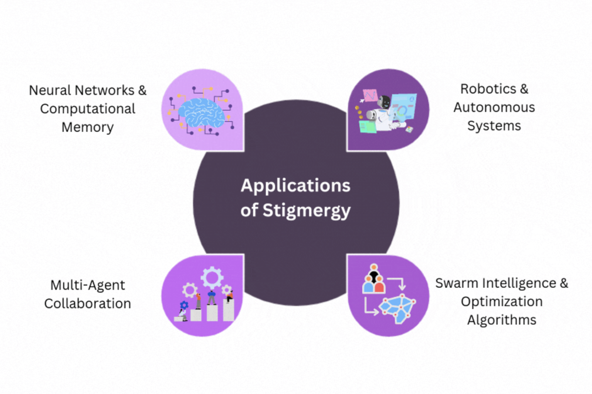
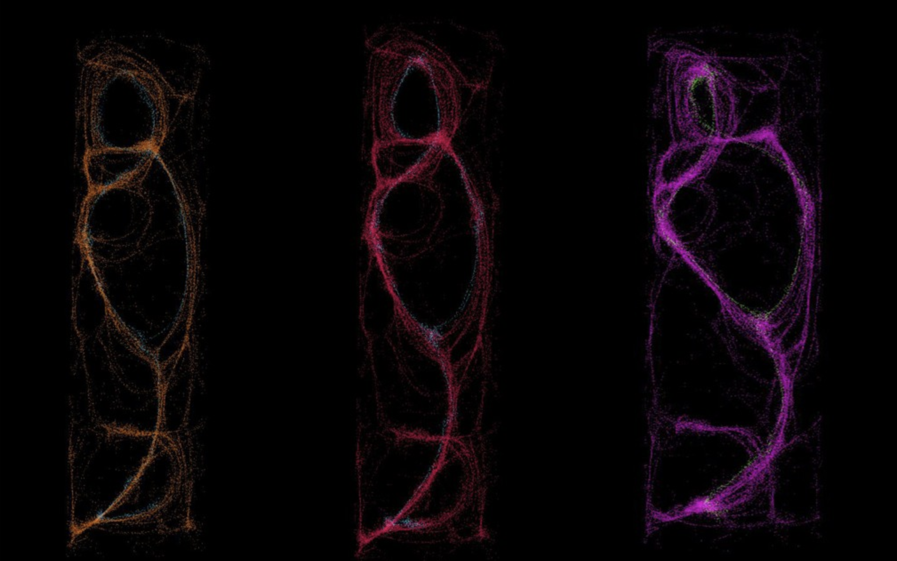

# collective intelligence

part of [[edge-city-patagonia-2025]] — miniconf: history and (bright) future

published on [x.com](https://x.com/mastercyb/status/1985800930428928474)

theory target (deep article, not this talk): [[egregore]]

## lineage

- [[Aristotle]]: [[wisdom of the crowds]] — potluck feast, everyone contributes dishes
- M. [[Condorcet]]: [[jury theorem]]
- W. M. Wheeler: [[superorganism]]
- [[Vernadsky]], Teilhard: [[noosphere]]
- [[Engelbart]]: three people working together in this augmented mode would seem to be more than three times as effective in solving a complex problem as one augmented person working alone
- ant colonies, bee hives, and bird flocks
	- complex problems (shortest paths to food, task allocation, long migrations) without central control → field of [[swarm intelligence]]
- [[ant colony optimization]] (ACO), Marco Dorigo — Traveling Salesman Problem

## methods

simple local rules ⇒ complex collective search and optimization

- random walk
- [[stigmergy]]

- market
- longest chain rule
- Conway's game of life

- [[emergence]]

## modern measures

- MIT Center for Collective Intelligence — Thomas Malone
- [[c-factor]] — Anita Williams Woolley ([Science 2010](https://gixstanford.wordpress.com/wp-content/uploads/2012/11/woolley-et-al-2010.pdf))
	- social sensitivity of group members
	- equality in distribution of conversational turn-taking
	- proportion of females in the group

## closing

boundaries between human and machine collective intelligence are blurring

see [[egregore]] for the formal framework; [[collective]] for the four processes
